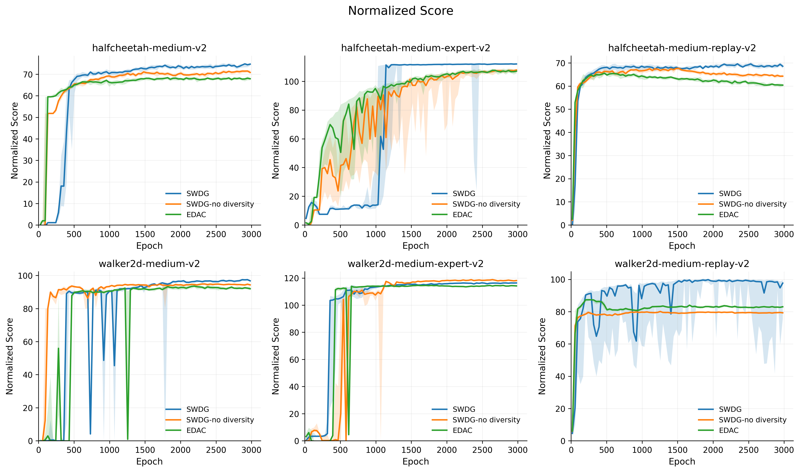
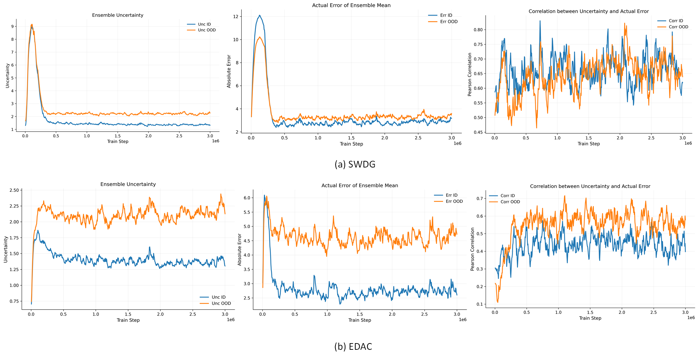
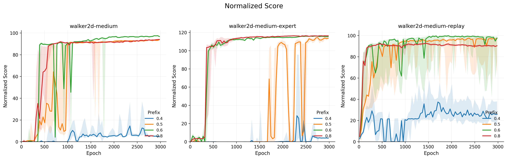

  

Figure 1. Comparison of learning curves for EDAC, SWDG without the diversity penalty, and SWDG.

 Table 1. Performance comparison on MuJoCo tasks.
| tasks             | halfcheetah-m | halfcheetah-m-ex | halfcheetah-m-re | walker2d-m | walker2d-m-ex | walker2d-m-re |
| ----------------- | :-----------: | :--------------: | :--------------: | :--------: | :-----------: | :-----------: |
| SAC-N             |     67.5      |      107.1       |       63.9       |    87.9    |     116.7     |     78.7      |
| SWDG-no diversity |     72.8      |      106.8       |       65.3       |    94.3    |     119.4     |     87.9      |
| EDAC              |     65.9      |      106.3       |       61.3       |    92.5    |     114.7     |     87.1      |
| SWDG              |     74.5      |      109.4       |       69.7       |    97.3    |     117.1     |     97.8      |

Table 2. Hyperparameters used in the D4RL MuJoCo Gym experiments.

| Task Name                 | EDAC ($N, \eta$) | SWDG ($N, \eta, rate, step$) |
| :------------------------ | :--------------: | :--------------------------: |
| halfcheetah-random        |     10, 0.0      |        6, 0.1, 0.6, 2        |
| halfcheetah-medium        |     10, 1.0      |        6, 0.5, 0.6, 2        |
| halfcheetah-expert        |     10, 1.0      |       10, 5.0, 0.6, 4        |
| halfcheetah-medium-expert |     10, 5.0      |       10, 5.0, 0.6, 4        |
| halfcheetah-medium-replay |     10, 1.0      |        6, 1.0, 0.6, 2        |
| halfcheetah-full-replay   |     10, 1.0      |       10, 1.0, 0.6, 4        |
| hopper-random             |     50, 0.0      |        50, 0, 0.6, 10        |
| hopper-medium             |     50, 1.0      |       50, 1.0, 0.6, 10       |
| hopper-expert             |     50, 1.0      |       50, 1.0, 0.8, 30       |
| hopper-medium-expert      |     50, 1.0      |       50, 1.0, 0.8, 20       |
| hopper-medium-replay      |     50, 1.0      |       50, 1.0, 0.6, 4        |
| hopper-full-replay        |     50, 1.0      |       50, 1.0, 0.6, 10       |
| walker2d-random           |     10, 1.0      |       10, 1.0, 0.6, 4        |
| walker2d-medium           |     10, 1.0      |       10, 2.0, 0.6, 4        |
| walker2d-expert           |     10, 5.0      |       10, 5.0, 0.8, 4        |
| walker2d-medium-expert    |     10, 5.0      |       10, 2.0, 0.8, 4        |
| walker2d-medium-replay    |     10, 1.0      |       10, 1.0, 0.6, 4        |
| walker2d-full-replay      |     10, 1.0      |       10, 1.0, 0.6, 4        |

  

Figure 2. Comparison of uncertainty-related metrics between EDAC and SWDG. The figure reports ensemble uncertainty, the actual error of the ensemble mean, and the Pearson correlation between uncertainty and actual error for both ID and OOD samples.

  

Figure 3. Learning curves on the walker2d-medium, walker2d-medium-expert, and walker2d-medium-replay tasks under different window-size settings.

